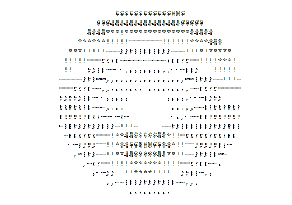

 

<h3>𝔸𝕟 𝕒𝕤𝕡𝕚𝕣𝕚𝕟𝕘 𝕡𝕣𝕠𝕘𝕣𝕒𝕞𝕞𝕖𝕣 𝕚𝕟 𝔹𝕣𝕒𝕫𝕚𝕝</h3>

- 🏫 Currently pursuing a Bachelor's degree in Computer Science at UFAL
- 🧠 Aspiring in Machine Learning and Neural Networks.
- ➕ Researcher in the area of Mathematics Optimization and Data Science.
- 🎈 Competitive Programming lover.
- 🎨 Design Patterns and Graphs algorithms.
- 📚 Proficient in C/C++ and Java.
- 📍 Currently based in Alagoas, Brazil.

 

<a href="https://bermeo.dev">

---

 
